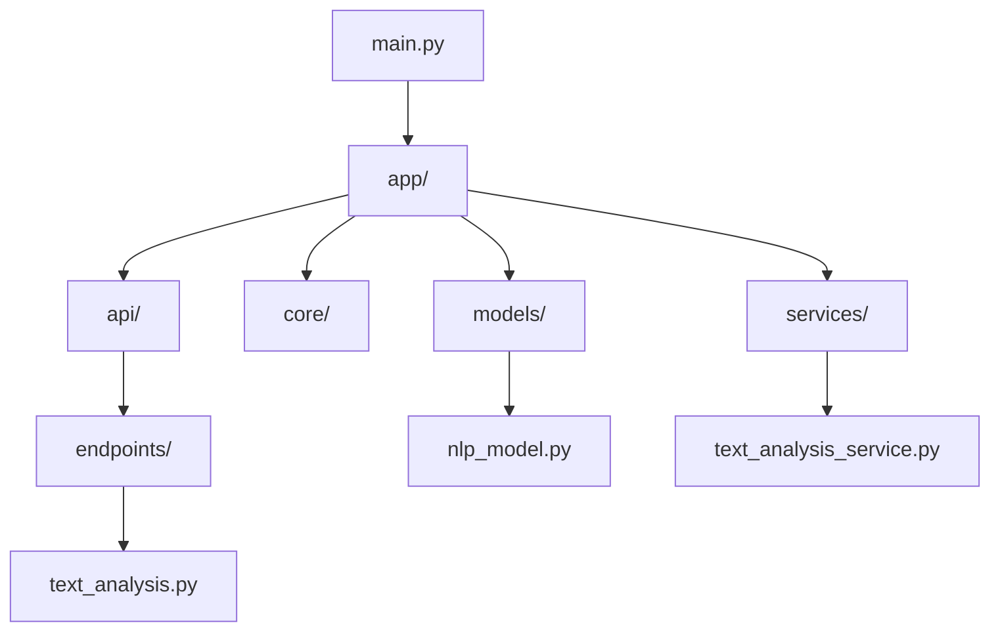

# TextAnalysis API

TextAnalysis API is an open-source project that provides natural language processing capabilities through a simple, self-hosted API. Built with Python, FastAPI, and various NLP libraries, it offers a range of text analysis features for developers and researchers. This project aims to provide a free, open-source alternative to commercial NLP services.

## Features

- Language Detection
- Sentiment Analysis
- Offensive Language Detection
- Named Entity Recognition
- Text Summarization (for longer texts)

## Technology Stack

- FastAPI for the API framework
- spaCy for Named Entity Recognition
- Hugging Face Transformers (DistilBERT) for Sentiment Analysis
- langdetect for Language Detection

## Project Structure



## Getting Started

1. Clone the repository:

   ```
   git clone https://github.com/gundurraga/TextAnalysis-API.git
   cd TextAnalysis-API
   ```

2. Install dependencies:

   ```
   pip install -r requirements.txt
   python -m spacy download en_core_web_sm
   ```

3. Run the API:
   ```
   python main.py
   ```

## Usage

Send a POST request to `/analyze` with your text:

```python
import requests

response = requests.post('http://localhost:8000/analyze', json={'text': 'Your text here'})
print(response.json())
```

## Response Format

The API returns a JSON object with the following structure:

```json
{
  "text_length": 123,
  "language": "English",
  "sentiment": { "positive": 0.95 },
  "is_offensive": false,
  "entities": [
    { "name": "John Doe", "type": "PERSON" },
    { "name": "New York", "type": "GPE" }
  ],
  "summary": "A brief summary of the text (for longer inputs)"
}
```

## Project Goals

1. Provide a free, open-source alternative to commercial NLP services
2. Focus on high-quality results while maintaining good performance
3. Support self-hosting with potential for online demo in the future
4. Prioritize security following OWASP guidelines

## Roadmap

- Improve and stabilize current features
- Add support for more languages (French, Spanish, Portuguese, Italian)
- Implement rate limiting and usage tracking for potential online demo
- Develop a web interface for easy testing (long-term goal)
- Continuously improve performance and response times

## Contributing

Contributions are welcome! Please feel free to submit a Pull Request. We're particularly interested in contributions that improve the quality of results, enhance performance, or add support for new languages.

## Security

We take security seriously. While we're continuously working to improve our security measures, we encourage users to report any security vulnerabilities they find. We aim to follow OWASP security guidelines where applicable.

## License

This project is licensed under the MIT License - see the [LICENSE](LICENSE) file for details.
