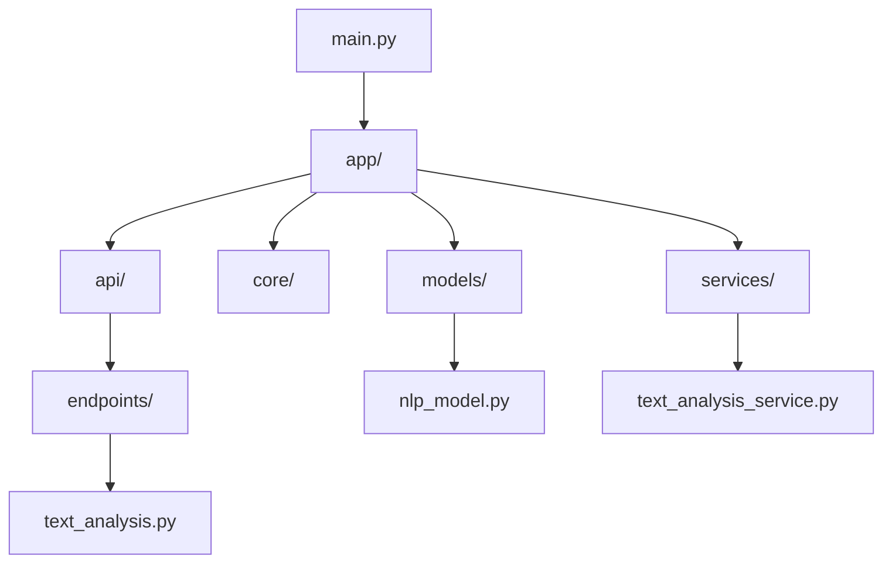

# TextAnalysis API

TextAnalysis API is an open-source project that provides advanced natural language processing capabilities through a simple API. Built with Python, FastAPI, and Hugging Face Transformers, it offers a range of text analysis features for developers and researchers.

## Features

- Language Detection
- Sentiment Analysis
- Offensive Language Detection
- Named Entity Recognition
- Text Summarization (for longer texts)

## Model

This project uses the TinyLlama/TinyLlama-1.1B-Chat-v1.0 model, a compact yet powerful language model suitable for various NLP tasks.

## Project Structure



## Getting Started

1. Clone the repository:

   ```
   git clone https://github.com/gundurraga/TextAnalysis-API.git
   cd TextAnalysis-API
   ```

2. Install dependencies:

   ```
   pip install -r requirements.txt
   ```

3. Run the API:
   ```
   python main.py
   ```

## Usage

Send a POST request to `/analyze` with your text:

```python
import requests

response = requests.post('http://localhost:8000/analyze', json={'text': 'Your text here'})
print(response.json())
```

## Response Format

The API returns a JSON object with the following structure:

```json
{
  "text_length": 123,
  "language": "English",
  "sentiment": "POSITIVE",
  "is_offensive": false,
  "entities": ["John Doe", "Acme Corp", "New York"],
  "summary": "A brief summary of the text (for longer inputs)"
}
```

## Goals

1. Enhance model accuracy and performance
2. Add support for more languages
3. Implement text classification for topics/categories
4. Develop a user-friendly web interface for API testing

## Contributing

Contributions are welcome! Please feel free to submit a Pull Request.

## License

This project is licensed under the MIT License - see the [LICENSE](LICENSE) file for details.
